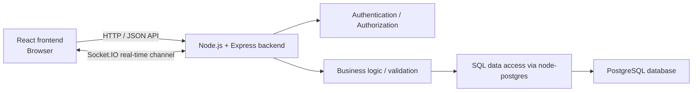

# System Architecture

## Request and data flow

```mermaid
flowchart LR
  browser["React frontend<br/>Browser"] -->|HTTP / JSON API| server["Node.js + Express backend"]
  server --> auth["Authentication / Authorization"]
  server --> business["Business logic / validation"]
  business --> data["SQL data access via node-postgres"]
  data --> postgres["PostgreSQL database"]
  server <-->|Socket.IO real-time channel| browser
```
